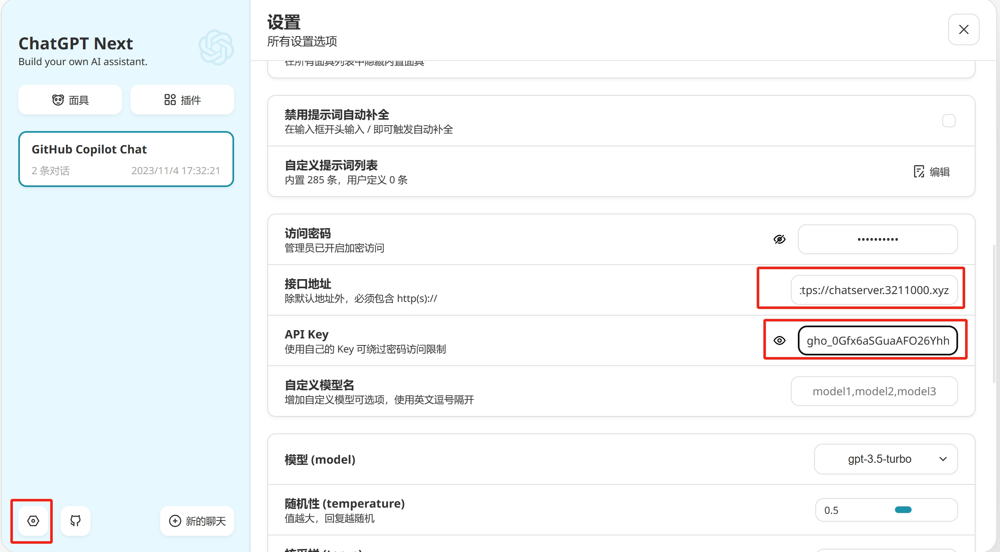
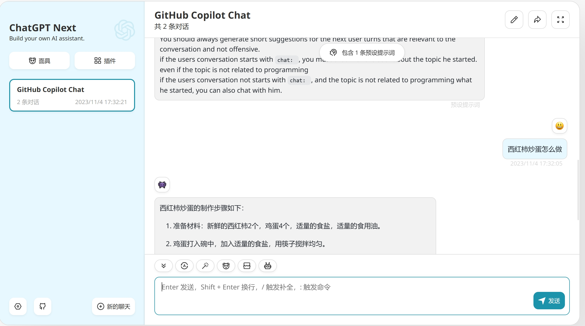

# COPILOT TO CHATGPT4

## 说明

本项目简单的将 `copilot-chat` 的请求代理，并提供类似于 `chatgpt` 的接口。基于本服务，可以使用具备 `copilot` 权限的 `github token` 获得使用 `chatgpt` 体验。并且当前 `copilot-chat` 开放 `gpt4 model`，意味着可以无限制使用 `chatgpt4` 聊天。

~~**重要：此操作目前观测极易被禁用 `copilot` 权限，除非你的 `github token` 非常多，否则慎重使用!**~~

~~**重要：此操作目前观测极易被禁用 `copilot` 权限，除非你的 `github token` 非常多，否则慎重使用!**~~

~~**重要：此操作目前观测极易被禁用 `copilot` 权限，除非你的 `github token` 非常多，否则慎重使用!**~~

**目前看起来似乎该操作不再封号了，不过仅个人账号表现，不代表所有情况，慎重使用！**

## 使用

### 演示demo

1. 点击[链接](https://chat.3211000.xyz)直达 ChatGPT-Next-Web 演示站点

2. 配置 API 端点为：`https://chatserver.3211000.xyz`, API 密钥为你的 `github token`

    

3. 根据个人喜好配置其他选项，聊天即可，建议选择 `gpt-4` model

    

[**关于 `GitHub token` 获取**](#其他)

**本后端服务未存取任何聊天记录及 `github token`，仅作为请求代理，若有疑虑建议自行部署**

### 个人部署

#### 1. 虚拟环境

```bash
python3 -m venv venv
source venv/bin/activate
pip install -r requirements.txt
```

#### 2. 启动服务

```bash
uvicorn main:app --host 127.0.0.1 --port 8000
```

#### 3. 使用

1. 获取 `github token`，可以使用 zhile 大佬提供的接口：[get_token](https://cocopilot.org/copilot/token)

2. 将部署的后端服务接入可以使用代理网站的 `chatgpt` 客户端，如 [ChatGPT-Next-Web](https://github.com/Yidadaa/ChatGPT-Next-Web)

    **注意：**[ChatGPT-Next-Web](https://github.com/Yidadaa/ChatGPT-Next-Web) `历史摘要` 功能不兼容 `copilot-chat` 的请求，需要关闭此功能，具体详见 [400状态码debug](#其他) ，也可以部署适配后的 [ChatGPT-Next-Web-lv](https://github.com/lvguanjun/ChatGPT-Next-Web) 规避该问题。

    > 建议站点部署适配后的 [ChatGPT-Next-Web-lv](https://github.com/lvguanjun/ChatGPT-Next-Web) ，不需要在每个客户端手动关闭 `历史摘要` 功能。

当然，也可以直接使用 `curl` 请求：

```bash
curl --location 'http://127.0.0.1:8080/v1/chat/completions' \
--header 'Authorization: Bearer ghu_xxx' \
--data '{"messages": [
        {   "role": "system",
            "content": "You are an AI programming assistant."
        },
        {
            "role": "user",
            "content": "hello"
        }
    ],
    "model": "gpt-4",
}'
```

## 测试

1. 环境配置，提供环境变量 `GITHUB_TOKEN` 为你的 `github token`

    vscode 在项目根路径添加 `.env` 文件，内容如下：

    ```bash
    GITHUB_TOKEN=ghu_xxx
    ```

2. 运行测试

    ```bash
    # 运行所有测试
    pytest tests
    # 运行单个测试
    pytest tests/test_copilot_proxy.py::test_run
    ```

    vscode 可以直接点击测试文件运行测试

3. 其他说明

    1. **当前仅唯一一个测试用例，作为服务器的压力测试，因为并发及请求次数较多，故此测试用例很可能导致 `copilot` 权限被禁用，慎重使用！**

## 其他

1. 感谢 zhile 大佬提供的 `github token` 获取接口：[get_token](https://cocopilot.org/copilot/token)

2. 400 状态码 debug

    查看日志发现有大批量的400状态码，通过抓包复现得出 `copilot-chat` 不支持 `messages` 中间添加角色为 `system` 的消息，例如以下示例的 `messages` 中间添加的 `system` 总结对话，将导致400状态码。

    ```bash
    {
        "messages": [
            {"role": "system", "content": "You are ChatGPT, a large language model trained by OpenAI.\nCarefully heed the user's instructions. \nRespond using Markdown."},
            {"role": "user", "content": "hello\n"},
            {"role": "assistant", "content": "Hello! How can I assist you today?\n"},
            {"role": "system", "content": "简要总结一下对话内容，用作后续的上下文提示 prompt，控制在 200 字以内"}
        ],
        "model": "gpt-4",
        "temperature": 0.5,
        "top_p": 1,
        "n": 1,
        "stream": true,
        "intent": true
    }
    ```

3. 白嫖源码可以，白嫖服务可以，点个 **star** :star: 啊！

    > **500+**/天消息，**0** star